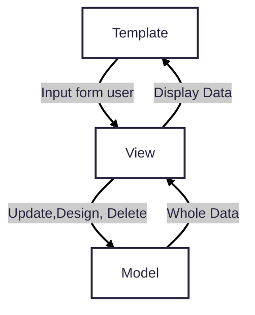

# **Personal Portfolio Website**

The project to develop the portfolio website was originally conceived as an educational one, with the aim of mastering new technologies and practical application of acquired knowledge.

 

## ___Technologies___ ##
MAIN:
* Pyhton 3.12.2 
* Django 5.0.6
* SQL Lite 3.4.4
* django-simple-captcha 0.6.0
* **Necessary packages for the django framework to work
  
VIEW:
* Bootstrap v5

 

## ___Architecture___ ##
* MTV (Model Template View)

## ___Database___ ##

TODO - Add scheme of DB

 

## ___Common___ ##
* In this project, the administration panel was stylistically customized to make it easier to add information to the site.
* Routing using templates and SLUG
* SQL queries were optimized using select related, perfetch related, and data caching 
